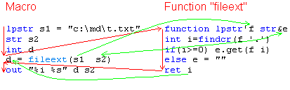

# 用户定义函数的技巧与建议

**另见**：[用户定义函数](IDH_FUNCTION.html)、[关于函数](../Language/IDH_FUNCTIONS.html)、[函数声明（参数等）](../Language/IDP_FUNCTION.html)、[QM 编程](../Reference/IDH_PROGRAMMING.html)

## 为什么及如何创建函数
用户定义函数是一种可从其他宏调用的宏。通过菜单“文件 -> 新建 -> 新函数”创建，可放置在除 System 文件夹外的任何位置。函数可从任何宏、函数、菜单或工具栏调用，也可在其他宏/函数代码中创建[子函数](../Language/IDP_DIR_SUB.html)。

当多个宏包含相同或相似代码时，为避免重复创建或复制代码，可将代码放入函数，宏通过函数名调用即可。例如：

**Macro1**：
```cpp
lpstr s1="c:\md\t.txt"
str s2
int i
;; 获取文件扩展名
i=findcr(s1 '.')
if(i>=0) s2.get(s1 i)
else s2=""
out "%i %s" i s2
```

**Macro2**：
```cpp
lpstr a="d:\mm\fav.mp3"
str b
int c
;; 获取文件扩展名
c=findcr(a '.')
if(c>=0) b.get(a c)
else b=""
out "%i %s" c b
```

上述宏重复使用获取文件扩展名的代码，可创建函数 `fileext`：

**Function fileext**：
```cpp
 /
function lpstr'f str&e
int i=findcr(f '.')
if(i>=0) e.get(f i)
else e=""
ret i
```

改进后的宏：

**Macro1**：
```cpp
lpstr s1="c:\md\t.txt"
str s2
int i
i=fileext(s1 s2)
out "%i %s" i s2
```

**Macro2**：
```cpp
lpstr a="d:\mm\fav.mp3"
str b
int c
c=fileext(a b)
out "%i %s" c b
```

**优势**：
- 宏更简洁，易读（函数名描述功能）。
- 修改扩展名逻辑只需更改函数，无需逐个修改宏。

**执行流程**（如图）：
- 红色线条：执行流向。
- 绿色线条：值传递与返回。
- 第二个参数为引用（`&`），函数接收变量 `e` 的地址，可修改其值。



## 接收与返回值
示例函数声明：
```cpp
 /
function# a str's [str&so]
```

- **限制运行**：以 ` /` 开头表示函数仅可从代码调用（宏、函数或回调函数），不可通过宏方式运行。可在“属性”对话框设置，或后接宏名（如 `/test`），按“运行”按钮时运行指定宏。
- **[function 语句](../Language/IDP_FUNCTION.html)**：定义参数和返回类型，不含函数名。
- **`#`**：表示返回整数（可用 `int` 替代，参见[类型声明字符](../Language/IDH_VARIABLES.html)）。
- **参数**：
  - `a`：整数类型（`int`），可写为 `int'a` 或 `#a`，但整数参数可省略类型声明。调用时复制调用者传递的值。
  - `str's`：字符串类型（`str`），可用 `~s`。调用时复制传递的值。
  - `str&so`：字符串引用参数，接收调用者变量的地址，函数修改 `so` 即修改调用者变量（按引用传递）。优点：避免字符串复制，提升性能；可返回多个值，替代 `ret`。`[ ]` 表示 `so` 为可选参数。
- **参数作用域**：参数为局部变量，每次调用时创建并初始化。
- **[ret 语句](../Flow/IDP_RET.html)**：退出函数并返回调用者继续执行，可返回值。若无 `ret` 或 `ret` 无值，返回 0。调用者等待函数运行完成。

## 传递与返回字符串、数组等
传递字符串的几种方式，各有优缺点（示例为单一参数，实际可组合任意数量、类型和顺序）：

1. **方式 1**：
   ```cpp
   function lpstr's ;; 或 function $s
   ```
   - **特点**：可传递任何字符串，传递数字报错。快速且类型安全。若需使用 `str` 函数，需在函数内赋值给 `str` 变量。
   - **建议**：适合了解 `lpstr` 的用户。勿修改字符串，因调用者可能传递常量。
   - **适用**：高性能需求场景。

2. **方式 2**：
   ```cpp
   function str's ;; 或 function ~s
   ```
   - **特点**：可传递字符串或数字（自动转换）。简单，无需了解 `lpstr`；可直接用 `str` 函数操作。
   - **缺点**：复制整个字符串，慢且大字符串耗内存；传递数字不报错，易出错。
   - **适用**：简单场景或初学者。

3. **方式 3**：
   ```cpp
   function str&s ;; 或 function ~&s
   ```
   - **特点**：必须传递 `str` 变量，函数可修改变量，常用于返回字符串值（如 `fileext` 示例）。快速且类型安全。
   - **缺点**：不可传递字符串常量（如 `"some text"`）或其他类型变量。
   - **适用**：需返回字符串或高性能场景。
   - **变体**：`function str*s` 类似方式 3，但需了解指针操作。

- **返回字符串**：函数声明为 `function'str` 或 `function'lpstr`，使用 `ret` 返回。易用但需注意变量作用域等，推荐使用方式 3 返回字符串。
- **数组与用户定义类型**：通常使用方式 3（如 `function ARRAY(str)&a`），快速且安全（不复制整个数据）。接口指针也适用方式 3，略快于方式 2（后者不复制整个对象）。

## 局部变量
函数中声明的变量（除非明确为全局或线程变量）为局部变量，函数退出时销毁，多次调用间不保留值，仅在函数内可见。调用者的变量在函数内不可见。参数（`function` 语句中定义）也是局部变量。

**另见**：[变量](../Language/IDH_VARIABLES.html)、[声明变量](../Language/IDP_VARIABLES.html)、[变量作用域](../Language/IDP_SCOPE.html)

## 帮助部分
参见[此处](../Other/IDP_F1.html)。

示例见下文。

## 其他建议
示例函数（无实际功能，展示实用技巧）：
```cpp
 /
function# a str's [str&so]
;; 功能描述...
;; 返回值: ...
;; a - ...
;; s - ...
;; so - ...
;; 备注
;; ...
;; 示例
 str s
 FunctionName 1 "abc" s
 out s

opt noerrorshere 1 ;; 将函数中的错误传递给调用者。替代方法：在函数末尾使用 err+ end _error
spe -1 ;; 设置速度与调用者相同（函数初始速度为 0）。对不含受 spe 影响的宏命令的函数无用
if(a=0) end "invalid argument" ;; 验证 a，若为 0 则报错，错误在调用者显示。若调用者未用 err 处理，宏终止
if(getopt(nargs) < 3) ;; 若省略第三个参数
	;; ... (更多代码)
	ret ;; 退出并返回 0
if(&so) ;; 若 so 有效（调用者可能传递 0 或省略参数）
	so.from(s a) ;; 修改引用传递的变量
;; ... (更多代码)
wait -2 ;; 自动延迟（等待调用者速度的毫秒数）。可考虑在某些函数末尾添加
ret 1 ;; 退出并返回 1
;; 此处无需 ret（函数默认返回 0）
```

## 使用密码
用户定义函数处理密码需确保安全性，不应传递未加密密码。安全的函数需满足以下要求：

1. **加密函数**：函数本身需加密。
2. **支持加密密码**：包含如下代码：
   ```cpp
   truepassword.decrypt(16 encryptedpassword "encryptionkey")
   ```
   - `truepassword`：`str` 变量，存储解密后的密码。
   - `encryptedpassword`：密码参数。
   - `encryptionkey`：函数独有的加密密钥。
   - 参见 [str.decrypt 和 str.encrypt](../str/IDP_S_ENCRYPT.html)。
   - 使用[选项 -> 安全](IDH_SETT_SECURITY.html)对话框或 `str.encrypt` 加密密码。QM 从函数提取密钥，生成格式为 `[*XXXXXXXXXXXXXXXXXX*]` 的加密密码。可直接传递（如 `Function(a b "[*0123456789ABCDEF*]")`）或嵌入字符串（如 `Function(a b "user=Me;password=[*0123456789ABCDEF*];")`）。
3. **不传递未加密密码**：避免将未加密密码传递给非安全函数。
4. **避免可见输入**：不粘贴或输入密码，避免密码以可见形式出现在任何地方。

- **输入密码**：使用 `AutoPassword` 函数将密码输入程序的密码字段，最简单且安全，无法输入非密码字段。
- **增强宏安全性**：加密宏并使用 [inpp](../Functions/IDP_INPP.html) 要求输入密码运行，可用“密码输入框”对话框。

**支持加密密码的 QM 函数**：`net`、`AutoPassword` 等。