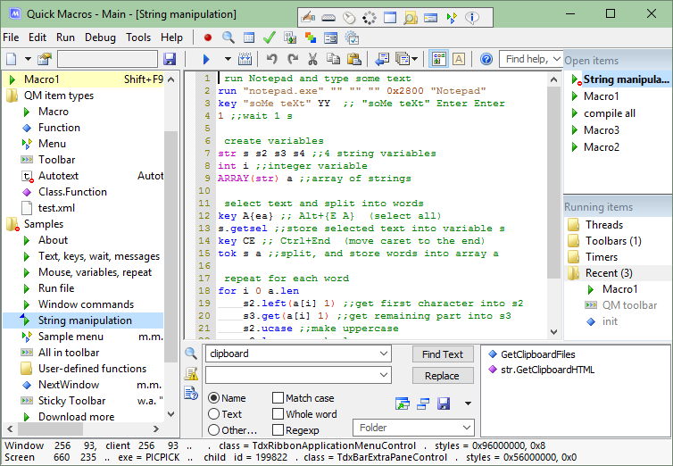

# 主窗口

Quick Macros (QM) 通常持续运行，主窗口大多时间隐藏。需添加或编辑宏时，点击 QM 托盘图标 。点击“关闭”按钮 (X) 隐藏窗口。

- **顶部**：[工具栏](IDH_MENU_TOOLBAR.html)、[文件菜单](IDH_MENU_FILE.html)、[编辑菜单](IDH_MENU_EDIT.html)、[运行和工具菜单](IDH_MENU_TOOLS.html)、[查找帮助、函数、工具](IDH_INTERFACE.html#A5)
- **左侧**：[项目列表](IDH_INTERFACE.html#A2)
- **中央**：[代码编辑器](IDH_INTERFACE.html#A3)
- **右侧**：[活动项目](IDH_INTERFACE.html#A4)
- **底部**：[输出、查找、提示](IDH_INTERFACE.html#A6)、[状态栏](IDH_INTERFACE.html#A7)
- **其他**：[代码工具栏](IDH_INTERFACE.html#A8)、[托盘图标](IDH_INTERFACE.html#A9)、[键盘快捷键](IDH_NAVIGATION.html)

## 项目列表
管理当前打开的[QM 文件](IDH_QML.html)中的[QM 项目](IDH_ITEMS.html)。

- 点击项目打开编辑。
- 中键点击关闭项目。
- 右键显示该项目的[文件菜单](IDH_MENU_FILE.html)，添加命令将在此处插入新项目。
- 拖放移动项目到其他位置。
- QM 2.4.0：右键拖动选择多个项目以移动，使用 Shift 添加到选择，Ctrl 添加/移除。
- Ctrl+拖放复制（克隆）项目。
- 拖放项目到编辑器文本（添加“运行宏”语句）、自定义工具栏（添加“运行宏”按钮）或编辑控件。
- QM 2.4.0：Alt+点击在右侧编辑器打开，Ctrl+点击移到主编辑器，Ctrl+Alt+点击在两个编辑器打开。
- QM 2.4.0：已删除项目在“Deleted”文件夹，可查看文本、恢复、删除或移动项目。

### 项目图标与颜色
- 每种 QM 项目类型有其[图标](IDH_ITEMS.html)，可在[图标对话框](IDH_ICONS.html)更改。
- **蓝色背景**：当前项目，编辑器显示其文本，图标上有小三角。
- **黄色背景**：打开的项目，参见“编辑器”和“活动项目”章节。
- **蓝色文本**：最近修改。
- **红色圆圈**：禁用触发器。
- **小“S”**：[共享文件夹](IDH_QML.html)。

## 编辑器
显示当前选中项目的代码（文本）。

- 右键显示[编辑菜单](IDH_MENU_EDIT.html)。
- 点击选择栏选择一行。
- 拖放选中文本。
- 右键选择栏启用/禁用单行。
- 选择多行（整行）后，右键选择栏或按 Space/Shift+Space 启用/禁用多行。
- 选择多行（整行）后，按 Tab/Shift+Tab 添加/移除行首制表符。

可打开多个项目，打开新项目不关闭当前项目，仅隐藏。可关闭项目以卸载文本、清空撤销历史、释放内存并从“活动项目”列表移除。可在主编辑器或右侧/底部次编辑器编辑项目，或同时在两个编辑器打开。

## 活动项目
“活动项目”列表类似多标签编辑器或浏览器的标签，显示当前打开的项目（左侧列表中为黄色）。右键显示“活动项目”菜单，中键点击关闭项目，编辑中项目的名称为蓝色。

“运行项目”面板显示当前运行的[线程](../Other/IDP_THREADS.html)、工具栏、定时器和最近启动项目。右键显示菜单，可终止线程、查找丢失工具栏、重置工具栏设置、停止定时器。私有文件夹（文件夹属性中勾选“私有函数”）的项目隐藏或显示为灰色，右键文件夹或空白处隐藏/显示。不显示分离进程中运行的宏的线程和定时器。

## 查找帮助、函数、工具
快速查找以下内容：
1. QM 帮助文件。
2. 代码工具栏对话框。
3. 公共 QM 系统文件夹中的函数。
4. 指定 QM 用户文件夹中的函数（点击下拉箭头，在弹出菜单中选择“选项”添加文件夹）。
5. 提示。
6. QM 论坛。
7. 互联网（Google）。

输入搜索查询并按 Enter，显示包含查询词的帮助主题、代码工具栏对话框、函数和提示的菜单。也可搜索论坛和互联网。查询可为问题、任务或任意顺序的单词，查找包含所有单词的主题，支持相似词（如 `get`、`gets`、`getting`），忽略停用词（如 `a`、`to`、`how`、`it`）和非单词字符。不支持短语搜索或运算符。示例：
- copy files
- how to move a window to a monitor
- acc
- dialog icon
- attaching toolbars to windows

F1 和 F2 与代码编辑器类似，例如输入函数或宏名，按 F2 打开，F1 查看帮助。成员函数需输入 `Classname.Membername`。

## 输出、查找、提示
- **输出面板**：显示错误消息、[out 消息](../Commands/IDP_OUT.html)和其他通知，右键查看[上下文菜单](IDH_MENU_TOOLS.html)。
- **查找面板**：查找宏、查找和替换文本、重命名宏。支持 AND 和 OR 运算符（需大写，OR 优先级较高）。中键点击快速清除文本字段。可保存当前查找面板文本和设置，存储在当前主[QM 文件](IDH_QML.html)中。
- **提示面板**：学习使用 Quick Macros。代码编辑器中输入或点击函数名等标识符后按 F1，其[帮助](../Other/IDP_F1.html)可能显示在此。

## 状态栏
显示鼠标相关信息：
- 第一行：窗口内鼠标位置、窗口名称、窗口类、窗口样式、扩展样式。
- 第二行：屏幕内鼠标位置、程序、子窗口 ID、子窗口类、子窗口样式、扩展样式。

还显示[函数简要信息](IDH_TYPEINFO.html)及其他临时信息。

## 代码工具栏
通过代码工具栏对话框输入常用宏命令，仅用于创建新代码，无法编辑现有代码。

仅部分命令有对话框，QM 包含数千命令和函数（许多适合程序员）。其他命令可在 QM 帮助、[弹出列表](IDH_TYPEINFO.html)、“查找帮助、函数、工具”字段或互联网查找。

对话框中许多字段可选，必填字段位于顶部（如“运行程序”对话框只需指定程序）。选项初始值设为常用值，通常无需更改。

部分对话框含“拖动图片”，可拖放到对象上自动填充字段（某些情况需手动编辑）。

对话框中可使用变量。需文本的字段中，变量需用括号括起来（除非有复选框等控件指定为变量）。需数值的字段无需括号。

## 托盘图标 
- **颜色**：
  - 蓝色：正常状态。
  - 灰色：QM 禁用（不响应键盘、鼠标等触发器）。
  - 红色：宏（非函数或菜单）运行中。
- **操作**：
  - 点击：显示 QM 窗口。若托盘图标隐藏（可在“选项”设置），点击 QM 快捷方式（如开始菜单）或按 Ctrl+Shift+Alt+Q。
  - 右键：显示菜单。
  - 中键点击：禁用或启用 QM。
  - Ctrl+点击：退出 QM。