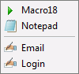

# 快速入门

- [什么是宏](#什么是宏)
- [Quick Macros 如何工作](#quick-macros-如何工作)
- [Quick Macros 窗口](#quick-macros-窗口)
- [创建新宏、菜单或工具栏](#创建新宏菜单或工具栏)
- [添加宏命令](#添加宏命令)
- [录制](#录制)
- [添加菜单项和工具栏按钮](#添加菜单项和工具栏按钮)
- [启动宏、菜单和工具栏](#启动宏菜单和工具栏)
- [如何知道宏正在运行](#如何知道宏正在运行)
- [如何终止运行中的宏](#如何终止运行中的宏)
- [如何将工具栏分配给窗口](#如何将工具栏分配给窗口)
- [如何创建“自动隐藏”工具栏](#如何创建自动隐藏工具栏)
- [管理工具栏](#管理工具栏)
- [如何创建文本替换（自动文本）宏](#如何创建文本替换自动文本宏)
- [宏能在任何程序中运行吗？](#宏能在任何程序中运行吗)
- [两个宏可以同时运行吗？](#两个宏可以同时运行吗)
- [可以自动化后台窗口吗？](#可以自动化后台窗口吗)
- [可以不运行 QM 就运行宏吗？](#可以不运行-qm-就运行宏吗)
- [发生错误时宏能继续运行吗？](#发生错误时宏能继续运行吗)
- [系统文件夹和其他默认项目是什么？](#系统文件夹和其他默认项目是什么)
- [输入点（.）时弹出的列表是什么？](#输入点时弹出的列表是什么)
- [禁用命令、添加注释](#禁用命令添加注释)
- [使用字符串；插入换行符和引号](#使用字符串插入换行符和引号)
- [重复执行](#重复执行)
- [使用变量](#使用变量)
- [常用 20 个命令](#常用-20-个命令)

**另见**：
- [教程](IDH_TUTORIAL.html)
- [视频教程](http://www.quickmacros.com/forum/viewtopic.php?f=7&t=7009)
- [参考](IDH_REFERENCE.html)
- [QM 编程（if、goto、函数等）](IDH_PROGRAMMING.html)

## 什么是宏
[宏](IDH_MACRO.html) 是一系列[命令](IDH_REFERENCE.html)的列表，运行宏时执行这些命令。命令可模拟手动操作，如输入文本、点击菜单、运行文件等。可为宏分配[触发器](IDH_PROPERTIES.html)（如热键），或放入工具栏，或通过其他方式启动。使用宏可将重复操作简化为单次点击或按键。

## Quick Macros 如何工作
在 [Quick Macros 窗口](IDH_INTERFACE.html) 中可创建宏和其他类型的[项目](IDH_ITEMS.html)（如函数、工具栏等）。为每个自动化任务创建宏，并可分配[触发器](IDH_PROPERTIES.html)（如热键）。  
QM 运行时监控触发器，当触发事件（如按下热键）发生时，执行分配的宏，并管理工具栏和菜单。

## Quick Macros 窗口
点击系统通知区域（时钟旁）的  或开始菜单中的图标显示 [Quick Macros 窗口](IDH_INTERFACE.html)。点击“关闭”按钮 (X) 隐藏窗口。  
窗口组成部分：
- **顶部**：菜单和工具栏。
- **左侧**：[QM 项目](IDH_ITEMS.html) 列表（宏、函数、菜单、工具栏等）。
- **中间**：代码编辑器，编辑当前选中项目的命令列表。
- **底部**：输出（错误和其他消息）、查找、提示、状态栏。

## 创建新宏、菜单或工具栏
为每个自动化任务创建宏。点击工具栏“新建宏”按钮，在列表顶部出现的字段中输入名称。创建其他类型[项目](IDH_ITEMS.html)（如函数、工具栏等），点击“新建宏”旁的小箭头，从弹出菜单选择。

## 添加宏命令
宏以[简单文本](IDP_SYNTAX.html)存储，通常每行一个命令。  
可通过代码工具栏的对话框添加命令，但 QM 未为所有命令提供对话框。可通过[查找帮助、函数、工具](IDH_INTERFACE.html#A5)字段（代码编辑器上方）、[参考](IDH_REFERENCE.html)或[列表](IDH_TYPEINFO.html)查找命令和对话框。  
最简单的添加键盘和鼠标命令方式是录制。

## 录制
可[录制](IDH_RECORD.html)键盘和鼠标操作，录制完整宏或部分内容。  
点击工具栏“录制”按钮或按 Ctrl+Shift+Alt+R 开始录制，完成后在 QM 录制对话框点击“插入”或“...”按钮。  
录制的宏可能不完美，需审阅和编辑。例如：
- 运行过快，需插入[延迟](IDP_WAIT.html)或修改 [wait 命令](../Commands/wait.html) 的等待时间。
- 录制的窗口名称可能包含文档名，需移除以避免其他文档打开时出错。  
录制时建议尽量使用键盘（如 Alt+下划线字母选择菜单项），因菜单或其他对象位置可能变化，即使鼠标坐标相对于窗口（默认）。

## 添加菜单项和工具栏按钮
[菜单文本](IDH_POPUP.html)为宏命令列表，每行由标签、空格和冒号后跟命令组成。[工具栏](IDH_TOOLBAR.html)类似，每行创建菜单项或工具栏按钮，执行相应命令。  
**示例**：
```cpp
Macro18 :mac "Macro18"
Notepad :run "$system$\notepad.exe"
-
Email :key "my@ema.il" * text.ico
Login :key "abcd"; key T; key "1234"; key Y * text.ico
```
  
- **添加宏**：从列表拖放宏到菜单/工具栏文本。
- **添加文件**：使用代码工具栏的“运行文件”对话框，或从桌面/Windows 资源管理器拖放文件。
- **添加其他命令**：使用代码工具栏的其他对话框。
- **添加分隔符**：输入 `-` 或 `|`。
- **添加图标**：使用[图标对话框](IDH_MENUICONS.html)。

## 启动宏、菜单和工具栏
启动宏的方式：
- QM 工具栏的“运行”按钮。
- [热键](IDH_TRIG_KEY.html)、[鼠标](IDH_TRIG_MOUSE.html)、[窗口](IDH_TRIG_WINDOW.html)或其他[触发器](IDH_PROPERTIES.html)，通过工具栏“属性”按钮分配。
- 将宏放入自定义[菜单](IDH_POPUP.html)或[工具栏](IDH_TOOLBAR.html)，打开菜单/工具栏并拖放宏到代码编辑器。可将工具栏附加到窗口。
- 在“属性”对话框点击“计划”按钮，安排宏在特定时间运行。
- 在“属性”对话框点击“快捷方式”按钮，创建桌面快捷方式。
- 其他程序通过[命令行](IDH_TRIG_COMMANDLINE.html)启动宏。
- 使用 [mac 命令](../Commands/IDP_MAC.html) 从另一宏启动。
- [自动文本列表](IDH_TSM.html)命令在输入特定文本时执行。  
菜单、工具栏和函数的启动方式与宏相同。

## 如何知道宏正在运行
[宏](IDH_MACRO.html)运行时，QM 托盘图标变为红色 。其他类型[项目](IDH_ITEMS.html)（如函数、菜单）或启用“同时运行”选项的宏运行时，托盘图标不变。可在 QM 窗口的“运行项目”面板或托盘菜单的“线程”对话框查看运行项目。

## 如何终止运行中的宏
宏运行时，托盘图标为红色 ，可按 Pause 键（可在“选项”中更改）手动终止。若输入被阻塞（宏中使用 [BlockInput](../User/IDP_QMDLL.html#BlockInput)），先按 Ctrl+Alt+Delete。  
[函数](IDH_FUNCTION.html)或启用“同时运行”选项的宏无法用 Pause 键终止，需通过 QM 窗口的“运行项目”面板或托盘菜单的“线程”对话框终止。若使用 [AddTrayIcon](../Functions/AddTrayIcon.html) 函数，可 Ctrl+点击其添加的托盘图标。  
**示例代码**：
```cpp
rep
	ifk(F12) ret ;; 按 F12 终止
	...
```

## 如何将工具栏分配给窗口
为工具栏分配[窗口触发器](IDH_TRIG_WINDOW.html)。在“属性”对话框选择“窗口”，拖动“拖动”图片并放到目标窗口上。可能需编辑或移除窗口名称，如移除当前打开的文档名。

## 如何创建“自动隐藏”工具栏
通过菜单“文件 -> 新建 -> 模板 -> 工具栏顶部或底部”或“工具栏左侧或右侧”创建。可分配[鼠标触发器](IDH_TRIG_MOUSE.html)或设置[启动时运行](IDH_TRIG_QM.html)。

## 管理工具栏
- 用右键拖动[工具栏](IDH_TOOLBAR.html)。
- Shift+拖动以移动或删除按钮。
- 从列表、桌面或 Windows 资源管理器拖放宏、文件或网络链接到工具栏。
- 右键菜单更改工具栏样式或打开编辑。  
若工具栏运行但不可见，在 QM 窗口的“运行项目”面板右键点击，选择“移到此处”或“重置”。

## 如何创建文本替换（自动文本）宏
无需为每个文本替换创建单独宏。可创建包含多个替换的[自动文本列表](IDH_TSM.html)，并分配“自动文本”或“键盘”触发器。

## 宏能在任何程序中运行吗？
宏可在任何 Windows 程序中运行。可设置宏仅在特定程序中运行。  
在某些程序中，触发器或命令可能失效，原因通常与安全或非标准输入方法相关。确保：
1. 在“选项 -> 常规”中选择“管理员”或“uiAccess”，而非“用户”。
2. 在“选项 -> 触发器”中勾选键盘和鼠标的低级钩子。

## 两个宏可以同时运行吗？
默认情况下，多个[宏](IDH_MACRO.html)不能同时运行。若宏（macro2）在另一宏运行时启动，macro2 不会运行。同一宏的多个实例也不会同时运行。  
在“属性 -> 宏属性”中选择“同时运行”可允许多个宏同时运行，详见[宏](IDH_MACRO.html)。  
多个[函数](IDH_FUNCTION.html)及同一函数的多个实例始终可同时运行。

## 可以自动化后台窗口吗？
宏无法在不激活后台窗口的情况下发送键盘和鼠标点击。但可（不总成功且较复杂）用其他命令替换键盘和鼠标命令，这些命令通常可在后台工作。通过代码工具栏的“窗口、控件”菜单插入此类命令。

## 可以不运行 QM 就运行宏吗？
可以，从宏和函数[创建可执行程序](IDH_MAKEEXE.html)。

## 发生错误时宏能继续运行吗？
宏启动时先进行[编译](IDH_DEBUG.html)和错误检查。若含[错误](IDP_ERRORS.html)，宏不执行，错误描述显示在 QM 输出中，错误位置高亮。  
运行时，若命令失败（如文件或窗口缺失），宏终止。使用 [err 命令](../Flow/IDP_ERR.html) 可在运行时错误后继续。  
**示例**：
```cpp
run "abc.exe" ;; 若 abc.exe 不存在，宏终止
err ;; 错误时继续
```

## 系统文件夹和其他默认项目是什么？
许多 QM 功能用 QM 语言编写，包括代码工具栏对话框、对话框编辑器及宏中可用的函数，均在“System”文件夹中。  
“Samples”文件夹仅用于学习，可删除。

## 输入点（.）时弹出的列表是什么？
[列表](IDH_TYPEINFO.html)包含宏中可用的函数和其他标识符。双击插入到宏中。列表顶部是类别（相关函数集合），双击类别弹出包含该类别函数的列表。

## 禁用命令、添加注释
以空格开头的行被禁用，也可用于添加[注释](IDP_COMMENT.html)。右键点击选择栏（宏文本左侧灰色条）快速禁用/启用单行。选择多行后右键选择栏禁用/启用多行。行末注释使用双分号。  
**示例**：
```cpp
;; 注释
key Cv ;; 按 Ctrl+V
```

## 使用字符串；插入换行符和引号
[字符串](IDP_CONSTANT.html)需用双引号括起来。字符串中用 `''` 表示双引号，用 `[]` 表示换行。  
**示例**：
```cpp
out "This is[]a multiline  string[]with ''double quotes''."
```
不替换引号等的写法：
```cpp
str s=
 This is
 a multiline string
 with "double quotes".
out s
```
在代码工具栏对话框中，输入纯文本无需引号。文本字段中使用变量需用括号括起来（除非有复选框等控件指定为变量）。

**另见**：[字符串中的变量](IDP_FSTRING.html)

## 重复执行
重复执行命令需使用 [rep 命令](../Flow/IDP_REP.html)。  
**示例**（重复执行两命令）：
```cpp
lef 100 200
key Y
```
添加 `rep` 并选择命令后按 Tab 缩进：
```cpp
rep
	lef 100 200
	key Y
```
重复 10 次：
```cpp
rep 10
	lef 100 200
	key Y
```
**另见**：[QM 编程](IDH_PROGRAMMING.html)

## 使用变量
[变量](IDH_VARIABLES.html)几乎可在代码中任何地方使用。整数值使用 `int` 类型，浮点值使用 `double` 类型，文本使用 `str` 类型。  
**示例**：
```cpp
;; 无变量
lef 100 200 "Notepad"

;; 使用变量
str s="Notepad" ;; 声明 str 变量 s，存储 "Notepad"
int x y ;; 声明 int 变量 x 和 y
x=100
y=x*2
lef x y s
```
共享变量在声明时加 `+`：
```cpp
int+ global_var
```
在代码工具栏对话框中，文本字段使用变量需用括号括起来，数值字段无需括号。  
**另见**：[QM 编程](IDH_PROGRAMMING.html)

## 常用 20 个命令
熟悉以下 20 个命令有助于创建和理解宏。部分命令可通过对话框或录制输入，但直接编写通常更快。

| 命令 | 描述与示例 |
|------|------------|
| [lef, rig](IDP_LEF.html) | 模拟鼠标左键或右键点击，可录制或使用“鼠标”对话框。```cpp<br>lef 100 200 ;; 在 100x200 像素点击<br>lef 90 40 "Notepad" ;; 在 Notepad 窗口 90x40 像素点击<br>``` |
| [key](IDP_KEY.html) | 按键盘键或输入文本，文本需用引号括起来，其他[按键](IDP_KEYCODES.html)可录制或使用“按键”对话框。```cpp<br>key "Australia" ;; 输入文本<br>'"Australia" ;; 同上（key 可替换为 '）<br>key F12 ;; 按 F12<br>key LLLL ;; 按左箭头 4 次<br>key Cv ;; 按 Ctrl+V<br>key A{ep} ;; 按 Alt+E+P<br>``` |
| [paste](IDP_PASTE.html) | 粘贴文本，可通过“文本”对话框输入。```cpp<br>paste "New Zealand" ;; 粘贴文本<br>"New Zealand" ;; 同上（可省略 paste）<br>paste s ;; 粘贴变量 s<br>``` |
| [out](IDP_OUT.html) | 在 QM 输出中显示内容（数字、字符串、变量等），用于[调试](IDH_DEBUG.html)或测试函数，可通过“文本”对话框输入。```cpp<br>out "I am here" ;; 显示文本<br>out i ;; 显示变量 i<br>``` |
| [mes](IDP_MES.html) | 在消息框显示内容，可通过“消息框”对话框输入。```cpp<br>mes "Important information"<br>if(mes("Continue?" "" "YN")='N') ;; 若用户点击“No”<br>	ret ;; 退出<br>``` |
| [run](IDP_RUN.html) | 运行文件、打开文档或网页，可通过“运行文件”对话框或拖放文件输入。```cpp<br>run "C:\WINDOWS\system32\notepad.exe"<br>run "http://www.quickmacros.com"<br>``` |
| [act](IDP_ACT.html) | 激活窗口，可通过“窗口”对话框输入。```cpp<br>act "Notepad"<br>``` |
| [win](IDP_WIN.html) | 查找窗口并返回窗口句柄，供其他命令使用，可通过“查找窗口或控件”对话框输入。```cpp<br>int hwnd=win("Internet Explorer" "IEFrame")<br>act hwnd<br>``` |
| [wait, wait for](IDP_WAIT.html) | 插入简单延迟或等待事件（如窗口），可通过“等待”对话框输入。```cpp<br>wait 5 ;; 等待 5 秒<br>0.5 ;; 等待 0.5 秒（可省略 wait）<br>wait 30 "Internet Explorer" ;; 最多等待 30 秒<br>``` |
| [mac](IDP_MAC.html) | 启动宏，通常用于菜单和工具栏，可通过拖放宏快速输入。```cpp<br>mac "Macro9"<br>``` **注意**：`mac` 不用于调用函数，启动的宏独立于当前宏，当前宏不等待其完成。 |
| [err](IDP_ERR.html) | 错误时继续执行宏。```cpp<br>wait 2 "Window" ;; 等待窗口 2 秒，超时抛出错误<br>err ;; 错误时继续<br>``` |
| [ret](IDP_RET.html) | 退出当前宏或函数。```cpp<br>if(i=0) ret ;; 若变量 i 为 0，退出<br>``` |
| [goto](IDP_GOTO.html) | 跳转到另一行。```cpp<br>if(i>=10) goto g1 ;; 若变量 i >= 10，跳转到 g1 标签<br>out "This line is executed only if i is < 10"<br> g1<br>out "This line is executed always"<br>``` |
| [if, else](IDP_IF.html) | 根据条件执行或跳过命令，命令需用 Tab 缩进（除非在同一行）。```cpp<br>if i<5 ;; 若变量 i < 5，执行以下两行<br>	out "variable i is < 5"<br>	i+1<br>else ;; 否则执行以下一行<br>	out "variable i is >= 5"<br>``` |
| [rep, break](IDP_REP.html) | 重复执行命令，命令需用 Tab 缩进（除非在同一行）。```cpp<br>rep 10 ;; 按右箭头 10 次<br>	key R<br>``` 重复直到变量 i > 5：```cpp<br>int i ;; 声明变量 i<br>rep<br>	i+1<br>	if i>5<br>		out "i is > 5"<br>		break ;; 退出循环<br>	out i<br>``` |
| [int, str](IDH_VARIABLES.html) | 声明变量，`int` 用于整数，`str` 用于字符串。```cpp<br>str s="Notepad" ;; 声明 str 变量 s，存储 "Notepad"<br>int x y ;; 声明 int 变量 x 和 y<br>int+ g_var ;; 声明全局 int 变量 g_var<br>``` |