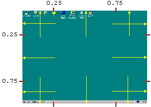
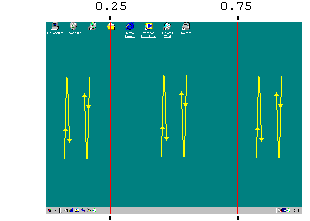
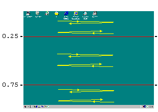

# 触发器：鼠标

## 概述

在鼠标点击、特定移动等情况下触发宏的执行。可以使用[属性对话框](IDH_PROPERTIES.md)分配此触发器。

## 鼠标触发器类型

### 1. 快速鼠标移动（或双次移动）到屏幕边缘

共有 12 个活动区域：

在[选项](IDH_SETT_TRIGGERS.md)中可以设置所需的鼠标速度。如果选中“Slow”，即使没有速度地触碰屏幕边缘，触发器也会生效。

### 2. 在三个垂直或水平区域内的快速鼠标移动（或双次移动）

- **垂直区域**（上下或下上移动）：
  

- **水平区域**（左到右或右到左移动）：
  

鼠标移动必须是快速的（类似 ，而不是  或 ），速度不能太慢或太快（大约 0.2 秒）。在[选项](IDH_SETT_TRIGGERS.md)中可以设置所需的移动幅度。

### 3. 鼠标左键、右键、中键、X1 或 X2 按钮的单击或双击

可以使触发器特定于窗口的某些部分（标题、最小化按钮等）。要针对控件或其他条件设置特定触发器，可使用[过滤函数](IDH_TFF.md)。

如果选中“Eat”，鼠标点击消息不会传递给应用程序。

### 4. 鼠标滚轮向前或向后滚动

## 注意事项

- **修饰键**：鼠标触发器可以与 Ctrl、Shift 和 Alt 修饰键组合使用。

- **“When released”选项**：如果未选中“When released”，宏将在修饰键和鼠标按钮仍按下时启动。QM 无法可靠地“吃掉”这些按键。如果宏发送键（`key`、`paste`/`outp`、`str.setsel`、`str.getsel`）或鼠标按钮，触发器的修饰键可能会对其产生影响。

- **冲突处理**：两个未禁用的宏不应使用相同的鼠标触发器，除非它们针对特定程序、显示器、命中测试代码或其他条件（参见[过滤函数](IDH_TFF.md)）。如果发生冲突，将运行在 QM 启动或当前文件打开时位于宏列表上方或更旧的宏。

- **低级鼠标钩子**：如果鼠标触发器在某些窗口（如 Windows Vista 的控制台窗口）或某些窗口的某些部分不生效，请在[选项](IDH_SETT_TRIGGERS.md)中选中“Use low-level mouse hook”。使用低级钩子时，当接收鼠标输入的程序繁忙时，鼠标移动触发器的效果更佳。

- **QM 2.2.0 注意**：命中测试代码有时可能与早期版本不同，尽管在大多数情况下相同。参见[选项](IDH_SETT_TRIGGERS.md)。