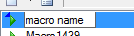
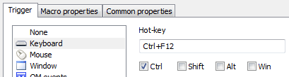
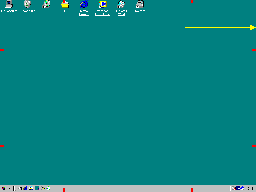
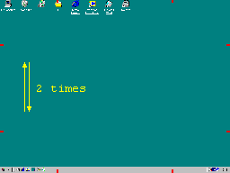

# 教程：创建宏、菜单和工具栏

本教程介绍如何使用 Quick Macros (QM) 创建宏、菜单和工具栏。QM 窗口通常隐藏，可通过点击系统托盘图标  显示。常用命令可通过代码工具栏的对话框输入，其他 [命令](IDH_REFERENCE.md) 需在代码编辑器中直接输入。使用工具栏上的 **Find help, functions, tools** 字段查找命令、对话框和帮助，详见 [界面](IDH_INTERFACE.md#A5)。

可通过点击工具栏的 **Record** 按钮或按 **Ctrl+Shift+Alt+R** [录制](IDH_RECORD.md) 键盘和鼠标操作。

## 教程内容

1. [按 Ctrl+F12 输入文本的宏](#macro-text-ctrl-f12)
2. [快速移动鼠标到屏幕右边缘运行或激活记事本的宏](#macro-notepad-right-edge)
3. [自动关闭 Abc 窗口的宏](#macro-close-abc-window)
4. [在 Internet Explorer 网页中填充用户 ID 和密码字段的宏](#macro-fill-web-form)
5. [鼠标上下移动两次显示的菜单](#menu-mouse-up-down)
6. [记事本窗口的工具栏](#toolbar-notepad)
7. [屏幕顶部边缘的自动隐藏工具栏](#toolbar-auto-hide)

**另见**：[视频教程](http://www.quickmacros.com/forum/viewtopic.php?f=7&t=7009)

---

## <a name="macro-text-ctrl-f12"></a>1. 按 Ctrl+F12 输入文本的宏

1. **创建新 [宏](IDH_MACRO.md)**：
   - 点击工具栏的 **New Macro** 按钮，在临时编辑字段输入宏名称。

   

2. **定义触发器**：
   - 点击工具栏的 **Properties** 按钮，在 [Properties](IDH_PROPERTIES.md) 对话框中选择 **Key**。
   - 在 **Hotkey** 字段同时按 **Ctrl** 和 **F12**，点击 **OK**。

   

3. **编写宏命令**：
   - 点击代码工具栏的 **Text** 按钮，在 **Text** 对话框输入文本，点击 **OK**。
   - 宏代码示例：

     ```qm
     key "First line of your text[]Second line"
     ```

4. **测试**：
   - 运行记事本，按 **Ctrl+F12**，宏将输入文本。

## <a name="macro-notepad-right-edge"></a>2. 快速移动鼠标到屏幕右边缘运行或激活记事本的宏

1. **创建新宏**：
   - 同上。

2. **定义触发器**：
   - 在 **Properties** 对话框中选择 [Mouse](IDH_TRIG_MOUSE.md)，选择 **Right edge** 和 **Top**。

3. **编写宏命令**：
   - 点击代码工具栏的 **Files, internet** 按钮，选择 **Run Program**。
   - 在 **Path** 字段输入 `notepad.exe`，或通过 **Browse** 选择程序文件/快捷方式。
   - 在 **Window** 字段输入窗口名称（如 `Notepad`，可部分匹配，需区分大小写），点击 **OK**。
   - 宏代码示例：

     ```qm
     run "$system$\notepad.exe" "" "" "" 1 "Notepad"
     ```

4. **测试**：
   - 快速将鼠标水平移动到屏幕右边缘顶部区域，宏将启动或激活记事本。使用鼠标移动触发宏可能需练习。

   

## <a name="macro-close-abc-window"></a>3. 自动关闭 Abc 窗口的宏

1. **创建新宏**：
   - 同上。

2. **定义触发器**：
   - 在 **Properties** 对话框中选择 [Window](IDH_TRIG_WINDOW.md)。
   - 使用查找工具或手动输入窗口名称和类（名称可部分匹配，需区分大小写），点击 **OK** 和 **Yes**，插入获取窗口句柄的代码。

3. **编写宏命令**：
   - 关闭窗口可用 [clo](IDP_CLO.md)、按 Esc 键、按按钮或鼠标点击等方式。此例使用 [clo](IDP_CLO.md)，可通过代码工具栏的 **Window** 对话框输入。
   - 宏代码示例：

     ```qm
     int hwnd=TriggerWindow
     clo hwnd
     ```

4. **测试**：
   - 打开 Abc 窗口，宏将自动运行并关闭窗口。

## <a name="macro-fill-web-form"></a>4. 在 Internet Explorer 网页中填充用户 ID 和密码字段的宏

1. **创建新宏**：
   - 命名为 `Id and Password`。

2. **定义触发器**：
   - 此宏无触发器，通过菜单运行（见下一示例）。

3. **编写宏命令**：
   - 若 ID 字段无焦点，需选择字段。避免使用鼠标（因字段位置可能变化），使用 HTML 元素函数：
     - 在代码工具栏打开 **Find Html Element** 对话框，拖动 **Drag** 图片到网页的 ID 字段。
     - 点击 **Test** 按钮确认找到 ID 字段（应看到黑色闪烁矩形），点击 **OK**。
     - 打开 **Html Element Actions** 对话框，选择 **Set Focus**，点击 **OK**。
     - 使用 **Text** 对话框输入 ID 和密码，使用 **Keys** 对话框按 Tab（选择密码字段）和 Enter。
   - 宏代码示例：

     ```qm
     Htm el=htm("INPUT" "id" "" "Internet Explorer" 0 0 0x221)
     el.SetFocus
     key "myid"
     key T
     key "mypassword"
     key Y
     ```

4. **添加到菜单**：
   - 打开或创建菜单，从列表拖放 `Id and Password` 宏到菜单文本，插入：

     ```qm
     Id and Password:mac "Id and Password"
     ```

5. **测试**：
   - 打开网页，运行菜单，选择 **Id and Password** 项。

**提示**：可使用代码工具栏的 **Message box, other -> Enter password** 对话框输入 ID 和密码。

## <a name="menu-mouse-up-down"></a>5. 鼠标上下移动两次显示的菜单

1. **创建新 [菜单](IDH_POPUP.md)**：
   - 点击 **New** 按钮旁的小箭头，选择 **New Menu**，输入名称。

2. **定义触发器**：
   - 在 **Properties** 对话框中选择 **Mouse**，选择 **Up-down** 和 **Left**，勾选 **Double**。

3. **添加菜单项**：
   - 每行菜单文本添加一个菜单项：
     - 运行宏：从列表拖放宏到菜单文本，或直接输入宏名称。
     - 运行文件：使用代码工具栏的 **Run File** 对话框，或从桌面/资源管理器拖放文件。
     - 其他命令：使用代码工具栏的其他对话框。
     - 多个命令：用分号分隔。
     - 分隔符：输入 `-` 或 `|`。
     - 可编辑项标签（`: ` 前文本）。
   - 菜单文本和菜单示例：

     ```qm
     Macro18:mac "Macro18"
     Notepad:run "$system$\notepad.exe"
     -
     Email:key "my@ema.il" * text.ico
     Login:key "abcd"; key T ; key "1234"; Y * text.ico
     ```

     

4. **分配图标**：
   - 点击工具栏的 **Icons** 按钮，在 **Icons** 对话框选择图标文件（左侧）或创建并保存新图标（右侧）。
   - 在菜单文本中点击要添加图标的行，在 **Icons** 对话框选择 **Actions -> Set icon of menu/toolbar item**，为其他项分配图标。

5. **测试**：
   - 在屏幕左侧快速上下移动鼠标两次，显示菜单。使用 [鼠标移动触发](IDH_TRIG_MOUSE.md) 可能需练习。

   

## <a name="toolbar-notepad"></a>6. 记事本窗口的工具栏

1. **创建新 [工具栏](IDH_TOOLBAR.md)**：
   - 点击 **New** 按钮旁的小箭头，选择 **New Toolbar**，输入名称。

2. **定义触发器**：
   - 在 **Properties** 对话框中选择 [Window](IDH_TRIG_WINDOW.md)，选择 **Active**。
   - 拖动 **Drag** 工具到记事本窗口，删除窗口名称中的文档部分（例如，将 `Untitled - Notepad` 改为 ` - Notepad`）。

3. **添加按钮**：
   - 与弹出菜单相同（见上例）。

4. **操作**：
   - 打开记事本后，工具栏将附着在窗口上。
   - 右键移动工具栏，左键调整大小，右键显示上下文菜单，Shift+拖动移动或删除按钮。
   - 从列表或桌面/资源管理器拖放宏、文件或网络链接到编辑器文本或工具栏添加按钮。

## <a name="toolbar-auto-hide"></a>7. 屏幕顶部边缘的自动隐藏工具栏

1. **创建新工具栏**：
   - 点击 **File -> New -> Templates -> Toolbar Top or Bottom**。

2. **定义触发器**：
   - 在 **Properties** 对话框中选择 **Mouse**，选择 **Top edge** 和 **Middle**，勾选 **Slow**。
   - 或选择 **QM file loaded** 触发器，使工具栏在启动时运行。

3. **添加按钮**：
   - 同上例。

4. **测试**：
   - 将鼠标移动到屏幕顶部边缘左侧，工具栏将显示。