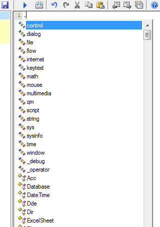
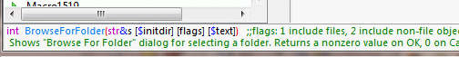

# 帮助和类型信息

## 概述

通过代码工具栏的对话框，可以输入一些常用的宏命令。如果工具栏不可用，请在“选项”中点击“检查扩展”按钮并按照说明操作。


然而，Quick Macros 并未为所有命令和函数提供对话框。需要直接在编辑器中输入这些命令和函数。可以通过[参考](IDH_REFERENCE.md)主题查找所有内置命令和函数。以下功能有助于查找命令和获取帮助。

## 自动完成和标识符列表

在文本中输入点号（`.`），例如在行首，会显示可用的函数和其他标识符列表。不同类型（函数、类型、常量、变量等）具有不同的[图标](IDP_DECLARATION.md)。要插入标识符，双击它，或开始输入后按 Tab 或 Enter 完成。



- **列表顶部**：显示[分类](IDP_CATEGORIES.md)，即相关函数的集合。在分类名称后输入 `.` 查看其包含的函数。
- **列表底部**：显示各种库。在库名称后输入 `.` 查看其内容。

**快捷键**：
- `Ctrl+,`：仅显示类型。
- `Ctrl+.`：显示全局函数。
- `Ctrl+/`：显示常量和变量。
- `Ctrl+;`：显示本地/线程变量，以及当前类的成员变量和函数。

对于特定类型的变量（如 `str`、`Acc`、`Database`、`ARRAY`、`BSTR`、COM 接口），输入 `.` 后会显示其成员函数。例如：

```qm
Ftp f
f.Connect("ftp.myserver.com" "user" "passw")
f.DirSet("public_html")
```

在列表中，隐藏和受限成员的名称显示为灰色。

若要隐藏用户定义的函数，将其置于[私有文件夹](IDH_FOLDERPROP.md)中。列表也不会显示以 `__`（双下划线）开头的标识符。要显示隐藏项目，按 `Ctrl+Shift+.` 或使用菜单“编辑 -> 成员 -> 显示隐藏”。

若已部分输入标识符，可使用“完成”命令（`Ctrl+Space`）显示列表。通常仅显示以相同字母开头的标识符。`Ctrl+.` 等命令也可用于此。

## 状态栏信息

当文本插入点位于标识符（函数、类型等，变量除外）上时，QM 状态栏会显示相关信息。按 `Ctrl+点击` 可在 QM 输出中查看详细信息。

- 可选参数用 `[ ]` 括起来。
- `|` 表示“或”。
- 参数名前可能带有类型名称或字符，如[函数声明](IDP_FUNCTION.md)中所述。例如，字符串参数以 `$` 或 `~` 开头。`~` 表示可传递字符串或数字。若未指定类型，默认为 `int`（整数）。
- 如果参数支持多种类型，显示 ``` 或最常用的类型。
- 简短描述和其他附加信息以注释形式（绿色）显示。有关如何为状态栏添加函数信息的说明，参见[此处](IDP_F1.md)。



内置和用户定义函数的状态栏信息始终可用。对于其他用户定义标识符，仅在标识符已[声明](IDP_DECLARATION.md)时可用，即宏或函数已[编译](IDH_DEBUG.md)，或标识符来自[类型库](IDP_TYPELIB.md)或[参考文件](IDP_REF.md)。在输入 `typelib.identifier` 时，QM 会自动声明类型库和参考文件中的标识符。QM 还可能从参考文件中查找信息以在状态栏显示。

## 获取帮助

要查看函数或其他标识符的帮助，输入或点击标识符后按 [F1](IDP_F1.md)。