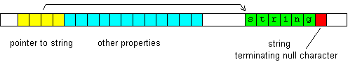

# 字符串

## 相关主题
- [字符串常量](../Language/IDP_CONSTANT.md)
- [在函数中使用字符串](../QM_Help/IDH_FUNCTIONTIPS.md)
- [Unicode 和 UTF-8](../Other/IDP_UNICODE.md)
- [包含变量的字符串](../Language/IDP_FSTRING.md)

## 概述
字符串是字符数组，用于存储文本。每个字符在内存中存储为一个字节（在 UTF-8 中为 1 到 4 个字节）。一个字节可以有 256 种不同的值，字符串末尾附加一个值为 0 的字节（“终止空字符”）。其他值用于表示[字符](../Tables/IDP_ASCII.md)。

字符串[变量](../Language/IDH_VARIABLES.md)通常是（或包含）指向字符串的指针，指针保存第一个字符的地址。以下图示说明了字符串变量在内存中的存储方式：


## 字符串变量的类型
字符串变量有以下几种类型：

- **str**：管理其字符串内存。
- **lpstr**：不管理字符串内存。
- **BSTR**：用于 Unicode UTF-16 字符串，主要与 COM 函数一起使用。管理字符串内存（类似 str）。
- **word***：有时用作 Unicode UTF-16 字符串。不管理字符串内存（类似 lpstr）。
- **VARIANT**：当包含 BSTR 时被解释为字符串，主要与 COM 函数一起使用。

在 C++ 编程语言和 MSDN 库中，字符串指针通常被称为 LPSTR、LPCSTR、char*、const char* 等。Unicode UTF-16 字符串指针通常被称为 LPWSTR、LPCWSTR、WCHAR*、OLECHAR* 等，也可能是 LPTSTR 及类似名称。

## str 类型的变量
`str` 类型的变量用于存储和操作字符串。`str` 变量在一个可变长度、自动（重新）分配的字符串缓冲区中存储字符串。缓冲区是一个字节数组，由变量在其他内存位置分配。除了指向字符串缓冲区的指针外，`str` 变量还有其他几个[属性](IDP_S_DATA.md)。在执行字符串操作时，所有属性都会自动调整。



### 赋值
将字符串或数值赋值给 `str` 变量时，该值会被复制到字符串缓冲区。数值会自动转换为字符串。例如：

```cpp
str s = "Cat"
 // 现在变量 s 是 "Cat"
s = 5.75
 // 现在变量 s 是 "5.75"
```

将 `str` 变量赋值给其他[内置类型](../Language/IDP_VARIABLES.md)的变量时，接收变量会得到指针值。将 `str` 变量作为函数参数传递时也是如此。要将 `str` 变量转换为有用的数值，请使用 [val](../Functions/IDP_VAL.md) 函数：

```cpp
str s = 45
 // 现在 s 是 "45"
int i = val(s)
 // 现在 i 是 45
```

### 字符访问
可以使用 `[]` 运算符访问单个字符：

```cpp
str s = "Cat"
int char = s[1]
 // 现在 char 是 97（'a' 字符的编码）
s[0] = 66
 // 现在 s 是 "Bat"（66 是 'B' 字符的编码）
s[2] = 'r'
 // 现在 s 是 "Bar"
```

### 运算符
`str` 类型支持以下[运算符](../Language/IDH_OPERATORS.md)：
- `=`（赋值）
- `+`（追加）
- `-`（前置）

```cpp
s = "Cat"
 // 现在 s 是 "Cat"
s + " and Mouse"
 // 现在 s 是 "Cat and Mouse"
s - "Dog, "
 // 现在 s 是 "Dog, Cat and Mouse"
```

类似 `s1 = s2 + s3` 的表达式不能用于连接字符串，因为在这种表达式中，`s2` 和 `s3` 被解释为数值（指针）。应使用 `s1.from(s2 s3)` 或 `s1=F"{s2}{s3}"`。

`str` 类型还支持比较运算符：
- `=`（相等，区分大小写）
- `!`（不相等，区分大小写）
- `~`（相等，不区分大小写）

```cpp
if(s = "Cat") out "s is 'Cat'"
```

### 成员函数
`str` 类型有多个成员函数，调用语法如下：

```cpp
s.func(...)
```

其中 `s` 是 `str` 变量，`func` 是成员函数名称，`...` 是参数。可以声明变量并调用函数：

```cpp
str s.function(...)
```

大多数 `str` 函数返回调用它们的 `str` 变量。例如：

```cpp
str s.fix(GetWindowText(hwnd s.all(100) 100))
```

等价于：

```cpp
str s
s.all(100)
int i=GetWindowText(hwnd s 100)
s.fix(i)
```

#### 成员函数列表
| 函数 | 描述 |
|------|------|
| [lcase ucase](IDP_S_LCASE.md) | 将字符串转换为小写或大写。 |
| [unicode ansi](IDP_S_UNICODE.md) | 将字符串转换为/从 Unicode UTF-16。 |
| [escape](IDP_S_ESCAPE.md) | 将转义序列替换为字符，或反之。 |
| [encrypt decrypt](IDP_S_ENCRYPT.md) | 加密或解密。 |
| [trim ltrim rtrim](IDP_S_TRIM.md) | 从字符串开头或结尾移除字符。 |
| [set](IDP_S_SET.md) | 设置字符串的一部分。 |
| [insert](IDP_S_INSERT.md) | 插入其他字符串。 |
| [remove](IDP_S_REMOVE.md) | 剪切字符串的一部分。 |
| [replace](IDP_S_REPLACE.md) | 替换字符串的一部分。 |
| [findreplace](IDP_S_FINDREPLACE.md) | 查找并替换。 |
| [replacerx](IDP_S_REPLACERX.md) | 使用正则表达式查找并替换。 |
| [addline](IDP_S_ADDLINE.md) | 将字符串追加为新行。 |
| [left right get geta](IDP_S_GET.md) | 获取其他字符串的一部分。 |
| [gett](IDP_S_GETT.md) | 查找并获取其他字符串的第 n 部分。 |
| [getl](IDP_S_GETL.md) | 查找并获取第 n 行。 |
| [getpath getfilename](IDP_S_PATH.md) | 从完整文件路径中提取路径或文件名。 |
| [from](IDP_S_FROM.md) | 从多个部分创建字符串（连接）。 |
| [fromn](IDP_S_FROMN.md) | 从指定长度的多个字符串或二进制部分创建字符串。 |
| [format, formata](IDP_S_FORMAT.md) | 格式化字符串（创建包含变量值的字符串）。 |
| [all](IDP_S_ALL.md) | 分配或释放字符串缓冲区。 |
| [fix](IDP_S_FIX.md) | 设置字符串长度。 |
| [getwintext setwintext getwinclass getwinexe](IDP_S_WINDOW.md) | 获取/设置窗口文本、类名或程序。 |
| [getclip setclip getsel setsel](IDP_S_CLIP.md) | 剪贴板操作（复制、粘贴）。 |
| [getfile setfile](IDP_S_FILE.md) | 读取或写入文件。 |
| [searchpath, expandpath](IDP_S_SEARCHPATH.md) | 查找文件并获取完整路径；展开特殊文件夹。 |
| [dospath](IDP_S_DOSPATH.md) | 从长路径获取短（DOS）路径，或反之。 |
| [getmacro](IDP_S_MACRO.md) | 获取宏文本。 |
| [setmacro](IDP_S_MACROS.md) | 设置宏文本。 |
| [dllerror](IDP_S_DLLERROR.md) | 获取 DLL 错误描述。 |
| [timeformat](IDP_S_TIMEFORMAT.md) | 格式化日期/时间字符串。 |
| [beg begi end endi mid midi](IDP_S_BEG.md) | 比较字符串的一部分。 |
| [getstruct setstruct](IDP_S_STRUCT.md) | 获取/设置用户定义类型的变量。 |
| [swap](IDP_S_SWAP.md) | 与另一个变量交换字符串。 |

## lpstr 类型的变量
虽然在大多数情况下会使用 `str` 变量，但在某些情况下使用 `lpstr` 变量更合适。与 `str` 变量不同，`lpstr` 变量没有字符串缓冲区，仅是指向以空字符终止的字符串的指针（见上文第一个图示）。它不管理（即分配内存）它指向的字符串。

与 `str` 和指针类似，`lpstr` 支持 `[]` 运算符来访问单个字符，并支持运算符 `=`、 `+` 和 `-`，但这些运算符仅修改指针，而不修改其指向的字符串：

```cpp
lpstr s = "abcd"
 // 现在 s 是（指向）"abcd"
s + 2
 // 现在 s 是（指向）"cd"
s - 1
 // 现在 s 是（指向）"bcd"
```

`lpstr` 变量不能使用 `str` 成员函数，也不能赋值数值（除了 0）。

## 空值
`str` 或 `lpstr` 变量可以为空，表示指向字符串的指针为 0，且未分配字符串内存。以下情况会导致空值：
- 变量刚声明但尚未赋值。
- 调用 [all](IDP_S_ALL.md) 而不带参数。
- 变量接收到空的 `str` 或 `lpstr` 表达式。
- 其他情况。

注意，空值与 `""` 不同。当 `str` 变量为 `""` 时，其长度为 0，但仍有一个字符串缓冲区用于存储终止空字符。

## 常用函数
除了上述 `str` 成员函数外，还可以使用全局字符串函数。这些函数可用于 `str` 和 `lpstr` 变量，调用方式与其他全局（非成员）函数相同。例如：

```cpp
int lens
lpstr s="abc"
lens=len(s)
```

### 全局函数列表
| 函数 | 描述 |
|------|------|
| [len](../Functions/IDP_LEN.md) | 获取字符数量。 |
| [empty](../Functions/IDP_EMPTY.md) | 检查字符串是否为空。 |
| [val](../Functions/IDP_VAL.md) | 获取数值。 |
| [numlines](../Functions/IDP_NUMLINES.md) | 获取行数。 |
| [find, findw](../Functions/IDP_FIND.md) | 查找子字符串或完整单词。 |
| [findt, findl](../Functions/IDP_FINDT.md) | 查找第 n 个标记或第 n 行。 |
| [tok](../Functions/IDP_TOK.md) | 分割字符串。 |
| [findc, findcr](../Functions/IDP_FINDC.md) | 查找字符或从右侧查找字符。 |
| [findcs, findcn](../Functions/IDP_FINDC.md) | 查找在/不在指定字符集中的字符。 |
| [findb](../Functions/IDP_FINDB.md) | 在二进制数据中查找子字符串。 |
| [findrx](../Functions/IDP_FINDRX.md) | 使用正则表达式查找一个或所有子字符串。 |
| [matchw](../Functions/IDP_MATCHW.md) | 使用通配符比较字符串。 |

全局字符串函数被添加到 [string 类别](https://quickmacros.com/help/str/..%5CLanguage%5CIDP_CATEGORIES.md)。您还可以在其中找到来自 DLL 的几个实用函数，例如 [StrCompare](../User/IDP_QMDLL.md#StrCompare)。要获取 DLL 函数的信息，请按 [F1](../Other/IDP_F1.md)。

## 注意事项
字符串函数不是线程安全的。不要在多个线程中同时使用同一变量，这可能会损坏数据并使 QM 不稳定。可以使用 [lock](../Commands/IDP_LOCK.md) 来防止这种情况。